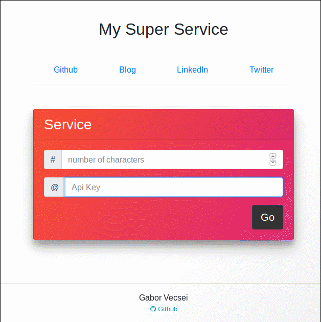

# Microservice Template with Docker

This is a small project where the following is combined in order to create a usable microservice template:

Right now, I wanted to keep it really simple so, the *magic service* only generates a random string with the size
the user defines. The user should include the Api Key and have more or equal available units than the size of the
random string.

- [RestAPI (Python + Flask)](https://github.com/pallets/flask)
- [Postgres Database](https://www.postgresql.org/)
- [Nginx](https://www.nginx.com/)
- [Postgres db explorer](http://sosedoff.github.io/pgweb/) (This can be removed, it is only used for testing)



## Test it

- Clone and start it:

    ```sh
    sudo ./start.sh
    ```

- You can reach the index page at `localhost:8080`. To use another port, just modify the `conf.d/app.conf` Nginx
configuration file.
- With `localhost:8080/microservice/add_test_users/5` you can create test Users and ApiKeys which you can use
- At `localhost:8080/microservice/sample_service` you can reach the sample RestApi endpoint

## Stop & Logs

- Stop it:

    ```sh
    sudo docker-compose down
    ```

- See the container logs:

    ```sh
    sudo docker-compose logs -f
    ```

## Todo

- [X] HTML Page
- [ ] Log In
- [ ] User Page
- [ ] Registration
- [ ] Billing (Buying units)